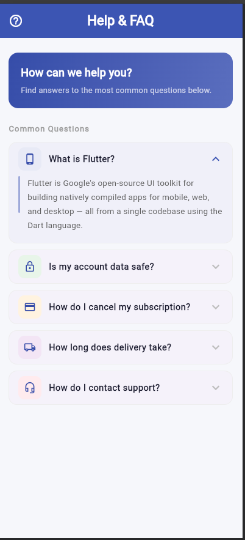

# FAQ App — ExpansionTile Widget Demo

A Flutter demo app that showcases the [`ExpansionTile`](https://api.flutter.dev/flutter/material/ExpansionTile-class.html) widget through a polished Help & FAQ screen. Each question card expands to reveal its answer and collapses when tapped again — a classic accordion-style interaction.

---

## Preview



---

## Widget: `ExpansionTile`

> Official docs: [api.flutter.dev — ExpansionTile](https://api.flutter.dev/flutter/material/ExpansionTile-class.html)

`ExpansionTile` is a Material widget that renders a tappable header row. When tapped, it animates open to reveal child content below; tapping again collapses it. It is ideal for FAQ screens, settings panels, and any accordion-style UI.

---

## Three Key Properties Demonstrated

| # | Property | Type | What it does in this app |
|---|----------|------|--------------------------|
| 1 | `title` | `Widget` | The always-visible header text the user sees and taps. Here it displays the FAQ question (e.g. *"What is Flutter?"*). Changing this changes what is shown in both the collapsed and expanded states. |
| 2 | `backgroundColor` | `Color?` | The fill color that appears **only while the tile is expanded**. Each tile uses a distinct pastel tint so the open state is clearly visible. When collapsed, this color disappears. |
| 3 | `initiallyExpanded` | `bool` | Controls whether the tile starts open or closed when the screen first loads. Set to `true` on the first tile so it greets the user already open; all others default to `false`. |

---

## Project Structure

```
faq_expansion_demo/
├── lib/
│   ├── main.dart                  # App entry point & MaterialApp setup
│   ├── screens/
│   │   └── faq_screen.dart        # Main FAQ screen with AppBar & question list
│   └── widgets/
│       └── faq_tile.dart          # Reusable FAQTile wrapping ExpansionTile
├── test/
│   └── widget_test.dart
└── pubspec.yaml
```

---

## Getting Started

### Prerequisites

- [Flutter SDK](https://docs.flutter.dev/get-started/install) installed
- A connected device or emulator

### Run the app

```bash
# 1. Clone the repository
git clone https://github.com/enockmugisha1/faq_expansion_demo.git
cd faq_expansion_demo

# 2. Install dependencies
flutter pub get

# 3. Launch the app
flutter run
```

---

## FAQ Items Included

| Icon | Question |
|------|----------|
| 📱 | What is Flutter? *(starts expanded)* |
| 🔒 | Is my account data safe? |
| 💳 | How do I cancel my subscription? |
| 🚚 | How long does delivery take? |
| 🎧 | How do I contact support? |

---

## References

- [ExpansionTile — Flutter API docs](https://api.flutter.dev/flutter/material/ExpansionTile-class.html)
- [Flutter Material Library](https://docs.flutter.dev/ui/widgets/material)
- [Flutter official documentation](https://docs.flutter.dev)
